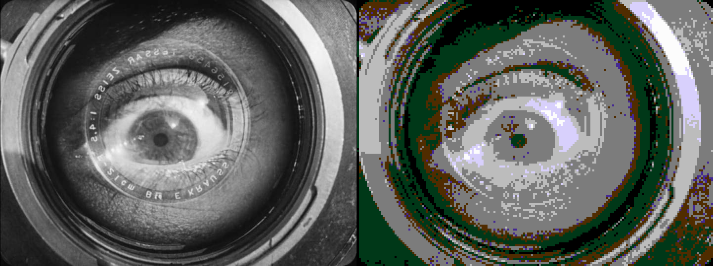

# nestylize

**nestylize** is a C program that lets you stylize your pictures by applying a
NES-style quantization filter. This program is distributed under **GNU GPL
v3**.


*A still from Dziga Vertov's film Man with a Movie Camera passed through the nestylize program.*

## Building

The only dependencies of this program are stb libraries, which are included in
as submodules. You can build the repository by following the instructions:

```sh
$ git clone --recursive https://github.com/GabrielMtins/nestylize.git
$ cd nestylize
$ make
```

## Usage

```sh
$ ./nestylize [FLAGS] <input> <output>
```

The output file **will** be a PNG. The program accepts the following flags:

- `--scale <factor>`: Scale factor (nearest neighbouring downsampling).
  Default: `4` (reduces both dimensions by a fourth). Example: `--scale 2`
  reduces both dimensions by a half.
- `--bayer <factor>`: Apply bayer dithering and a factor for its intensity.
  Example: `--bayer 2`.

## Examples:

Basic usage with default settings (scale 4x down and no dithering):

```sh
$ ./nestylize input.png output.png
```
